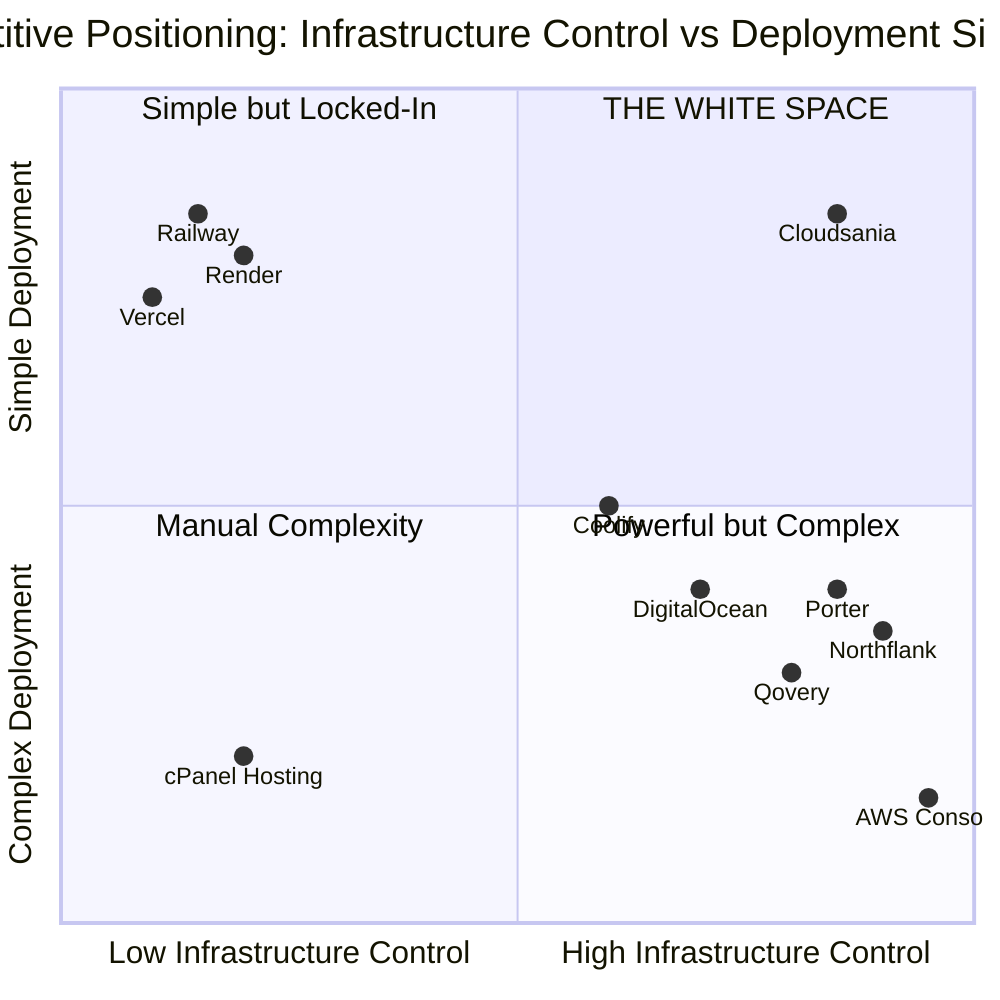

# Competitive Landscape Analysis v2: The Deployment Simplicity Ecosystem

**Status:** Verified & Live  
**Date:** January 25, 2026  
**Version:** 2.5 (Hierarchy Fix & Heroku Enrichment)  
**Positioning:** Heroku-like Simplicity with Full Infrastructure Control

---

## 1. Executive Summary

### 1.1 Market Positioning

Cloudsania operates as a **Control Plane Orchestrator**—not a traditional PaaS, IaaS, or hosting provider. We sit between developers and infrastructure, providing deployment abstraction without owning the underlying cloud.

**The "Orchestration Gap" in Africa:**

| Market Segment | Current State | Cloudsania Opportunity |
|:---|:---|:---|
| **Global PaaS** (Heroku, Vercel) | "Pricing Purgatory" + USD-only payment | "Keep workflow, predictable costs" |
| **Modern Control Planes** (Northflank, Porter) | USD/Card only = inaccessible | "Same power, local payment" |

### 1.2 Strategic Positioning

**Primary Differentiator: White Space Positioning**
> "Cloudsania occupies the white space where **Heroku-like deployment simplicity** meets **full infrastructure control**."

**Positioning Hierarchy:**

1. **PRIMARY: Simplicity + Control (White Space)**
   - Heroku-like UX without Kubernetes complexity
   - BYOC model (deploy to your own AWS/DO/Vultr)
   - Only platform combining both advantages

2. **SECONDARY: Reliability**
   - 99.9% SLA (Product Capabilities validated)
   - Enterprise-grade infrastructure

3. **TERTIARY: African Convenience**
   - Local payment (Paystack card payments)
   - African timezone support
   - Local currency support (Naira)

### 1.3 Competitive Moat

> **"Heroku-like simplicity with full infrastructure control. Built for Africa."**

**We win by being the only platform that combines:**

1. ✅ **Deployment simplicity** - Heroku UX without Kubernetes (PRIMARY)
2. ✅ **Infrastructure control** - BYOC model (PRIMARY)
3. ✅ **Enterprise reliability** - 99.9% SLA (SECONDARY)
4. ✅ **Local convenience** - Paystack card payments (TERTIARY)

### 1.4 What Problems We Solve (Validated Pain Mapping)

| Pain ID | Problem | Our Solution |
|:---|:---|:---|
| **AG-01** | **Multi-Site Management Chaos** | Unified dashboard for all clients |
| **AI-03** | **Cloud Cost Opacity** | Predictable per-user pricing |
| **TD-01** | **Deployment Complexity** | Git-push deployment (Zero config) |
| **FS-05** | **Vendor Lock-in Fear** | BYOC (Deploy to your own AWS) |
| **FS-01** | **Data Residency Compliance** | Deployment to local/compliant zones |

---

## 1.5 Competitive Positioning Map



**Reading the Map:**
- **Quadrant 1 (Top-Right):** THE WHITE SPACE — Simple deployment + Full control = **Only Cloudsania**
- **Quadrant 2 (Top-Left):** Simple but Locked-In — Easy to use but no infrastructure control (Render, Railway, Vercel)
- **Quadrant 3 (Bottom-Left):** Manual Complexity — Traditional DevOps, requires expertise
- **Quadrant 4 (Bottom-Right):** Powerful but Complex — Full control but requires DevOps expertise (Northflank, Porter)

---

### 1.5.1 White Space Definition

**Our Unique Market Position:**

> "Cloudsania occupies the white space where **Heroku-like deployment simplicity** meets **full infrastructure control**, with **African-market convenience** as a tertiary benefit."

**What This Means:**

**Primary Differentiator: Simplicity + Control**
- Render/Railway have simplicity but NO infrastructure control (locked-in)
- Northflank/Porter have control but NO deployment simplicity (Kubernetes complexity)
- **Only Cloudsania combines both**: Git-push deploys + BYOC flexibility

**Secondary Differentiator: Reliability**
- BYOC competitors (Northflank, Porter) have control but require DevOps expertise
- **Cloudsania**: 99.9% SLA + simplified deployment (no Kubernetes required)

**Tertiary Benefit: African Convenience**
- Global competitors don't accept local payment methods
- **Cloudsania**: Paystack card payments accepted, African timezone support

**The White Space Formula:**
```
Heroku Simplicity + AWS Control + African Convenience = Cloudsania
```

**Competitive Gaps Exploited:**
1. **vs Render/Railway**: "Same UX, but you own the infrastructure"
2. **vs Northflank/Porter**: "Same BYOC, but simpler UX (no Kubernetes)"
3. **vs All Global Competitors**: "Oh, and we accept local payment"

---

## 1.6 Comprehensive Competition Matrix

### Feature Comparison

| Competitor | Heroku-like UX | Zero-config Deploy | BYOC | Multi-Cloud | Local Payment | Predictable Pricing | SLA | 24/7 Support | **Match %** |
|:---|:---|:---|:---|:---|:---|:---|:---|:---|:---|
| **Cloudsania** | ✅ | ✅ | ✅ | ✅ | ✅ | ✅ | ✅ | ✅ | **100%** |
| Northflank | 🟡 | 🟡 | ✅ | ✅ | ❌ | ❌ | ✅ | ✅ | 60% |
| Porter.run | 🟡 | 🟡 | ✅ | ✅ | ❌ | ❌ | ✅ | ✅ | 60% |
| Railway | ✅ | ✅ | ❌ | ❌ | ❌ | ❌ | ✅ | ✅ | 50% |
| Render | ✅ | ✅ | ❌ | ❌ | ❌ | ❌ | 🟡 | ✅ | 50% |
| Vercel | 🟡 | ✅ | ❌ | ❌ | ❌ | ❌ | ✅ | ✅ | 40% |
| Coolify | 🟡 | 🟡 | ✅ | ✅ | N/A | ✅ | ❌ | ❌ | 40% |

### Pricing Comparison (5-Person Team Scenario)

| Competitor | Pricing Model | Entry Price | 5-User Team Cost | vs Cloudsania | Advantage? |
|:---|:---|:---|:---|:---|:---|
| **Cloudsania** | Per-user flat | $15/user | **$75/mo** | — | Baseline |
| Northflank | Usage ($0.016/hr) | $2.70/mo | $50-150/mo | 🟡 Variable | Comparable |
| Porter.run | Per-resource | $3/mo | $60-200/mo | 🟡 Variable | Comparable |
| Qovery | Per-developer | $29/dev | **$145/mo** | ✅ +93% | **Cheaper** |
| Vercel Pro | Per-user | $20/user | **$100/mo** | ✅ +33% | **Cheaper** |
| Railway | Usage credits | $5 + usage | Unpredictable | ✅ Predictable | **Cheaper** |
| Coolify | Free (DIY) | $0 | $0 + time | ❌ Premium | More expensive |
| Render | Per-service | $7/service | ~$35-100/mo | 🟡 Variable | Comparable |

### Pricing Insight

> **Cloudsania is NOT the cheapest. Cloudsania is the BEST VALUE for African teams.**

| vs Competitor | Price Position | Real Advantage |
|:---|:---|:---|
| vs Qovery/Vercel | ✅ Cheaper | Lower cost + Paystack payment |
| vs Northflank/Porter | 🟡 Comparable | Same price + Paystack payment |
| vs Coolify | ❌ Premium | Worth it for support + SLA |

---

## 2. Layer 1: Direct Competitors (Control Plane Category)

*Entities competing for the "Orchestration" budget.*

### 2.1 Commercial Control Planes

#### Northflank (The Primary BYOC Competitor)

| Attribute | Details |
|:---|:---|
| **Positioning** | "Enterprise Container Platform" |
| **Website** | [northflank.com](https://northflank.com) |
| **BYOC Support** | ✅ AWS (all regions incl. Cape Town), GCP, Azure |
| **GPU Support** | ✅ A100, H100, B200 |
| **Pricing Model** | Usage-based: $0.01667/vCPU/hr + $0.00833/GB RAM/hr |
| **Network Egress** | $0.06/GB |
| **Storage** | $0.15/GB/month (NVMe) |
| **Payment Methods** | ❌ **USD/Stripe only** |
| **African Support** | ❌ None |

**User Praise (G2/AWS Marketplace):**
- "It just works"—intuitive UI
- "No level 1 support hell"—instant expert responses
- "Heroku migration in 1 afternoon"

**Weaknesses:**
- ❌ Requires Kubernetes knowledge to configure properly
- ❌ Complex UI for non-DevOps developers
- ❌ USD/Stripe payment only
- ❌ No African timezone support

**Cloudsania Advantage:**
- **"Same infrastructure control, simpler UX"** - No Kubernetes complexity required
- Heroku-like deployment experience (git-push deploys)
- Local payment accepted (Paystack card)
- African timezone support

**Battle Strategy:**
> "Love Northflank's BYOC power? We give you the same infrastructure control, but with **Heroku-like simplicity**. No Kubernetes expertise required. Oh, and we accept local payment methods."

---

#### Porter.run

| Attribute | Details |
|:---|:---|
| **Positioning** | "Heroku in your own cloud" |
| **Website** | [porter.run](https://porter.run) |
| **BYOC Support** | ✅ AWS, GCP, Azure |
| **Porter Cloud** | $10/GB RAM/month + $20/vCPU/month (metered) |
| **Startup Credits** | None listed publicly (previously $1k for YC) |
| **SOC2/HIPAA** | ✅ One-click compliance |
| **Payment Methods** | ❌ **USD/Stripe only** |

**User Praise:**
- "x10 your development speed"
- "Best customer support I've experienced"
- "Significant savings vs Heroku"

**Weaknesses:**
- ❌ Credit expiry creates uncertainty ("What happens after my $1,000 runs out?")
- ❌ Requires understanding of per-GB/vCPU pricing
- ❌ USD/Stripe payment only
- ❌ Complex pricing calculator

**Cloudsania Advantage:**
- **"Simpler pricing, no credit games"** - Flat pricing from day 1
- Know your costs upfront (no surprises when credits expire)
- Heroku-like UX without credit complexity
- Local payment accepted

**Battle Strategy:**
> "Love Porter's BYOC model? We give you the same, but with **transparent flat pricing**. No credit expiry games. No per-GB calculations. Just predictable monthly costs. Oh, and we accept local payment."

---

#### Render.com

| Attribute | Details |
|:---|:---|
| **Positioning** | "Cloud Application Platform" - Heroku alternative |
| **Website** | [render.com](https://render.com) |
| **BYOC Support** | ❌ **Managed-only** (no BYOC) |
| **Pricing** | $0-29/user/month + compute costs |
| **Hobby Tier** | $0/month + compute (personal projects) |
| **Professional** | $19/user/month + 500GB bandwidth, preview environments |
| **Organization** | $29/user/month + SOC 2, audit logs, unlimited team |
| **Payment Methods** | ❌ **USD only** |

**User Praise:**
- "Heroku-like simplicity without Heroku pricing"
- "Git-push deploys just work"
- "Preview environments are game-changing"
- "Managed databases included"

**Weaknesses:**
- ❌ No BYOC (locked into Render infrastructure)
- ❌ No local payment methods
- ❌ US-centric pricing and support
- ❌ Can't bring your own cloud credits

**Cloudsania Advantage:**
- **"Render UX + your AWS account"** - Same simplicity, but you own the infrastructure
- Local payment accepted (Paystack card)
- BYOC means you can use reserved AWS instances (cheaper long-term)
- Not locked into one vendor

**Battle Strategy:**
> "Love Render's simplicity? We give you the same experience, but with **full infrastructure control**. Deploy to your own AWS, DigitalOcean, or Vultr account. Plus, we accept local payment methods."

---

#### Railway.app

| Attribute | Details |
|:---|:---|
| **Positioning** | "Pay only for what your app uses, by the second" |
| **Website** | [railway.app](https://railway.app) |
| **BYOC Support** | ❌ **Enterprise Plan Only** (not available for most users) |
| **Trial** | $0 for 30 days with $5 one-time credit |
| **Hobby** | $5/month + $5 monthly credits |
| **Pro** | $20/month + $20 monthly credits |
| **Enterprise** | Custom (SSO, HIPAA, BYOC, Dedicated VMs) |
| **Usage Costs** | Memory: $10/GB/month, CPU: $20/vCPU/month |
| **Payment Methods** | ❌ **USD/Card only** |

**User Praise:**
- "Deploy in 3 clicks from GitHub"
- "Zero-config deploys"
- "Every GitHub push = deployment"
- "Fastest onboarding I've ever experienced"

**Weaknesses:**
- ❌ **Credit expiry model** ($5/mo credits - unpredictable costs after)
- ❌ No BYOC for Trial/Hobby/Pro tiers
- ❌ Usage-based pricing can spike unexpectedly
- ❌ $1/mo sounds cheap until you scale
- ❌ No local payment methods

**Cloudsania Advantage:**
- **"No credit games"** - Flat pricing from day 1, you know your costs
- BYOC for all tiers (not just Enterprise)
- Predictable billing (not usage-based surprises)
- Local payment accepted

**Battle Strategy:**
> "Railway's simplicity without the credit trap. **Know your costs on day 1, not month 7.** Same zero-config deploys, but with flat pricing and your own infrastructure."

---

#### Qovery

| Attribute | Details |
|:---|:---|
| **Positioning** | "Internal Developer Platform" |
| **Key Feature** | Ephemeral environments (clone prod for testing) |
| **Pricing** | Per-developer ($29-$89/dev/month) |
| **Payment Methods** | ❌ USD only |

**Cloudsania Advantage:**
- **Project-based pricing** (better for agencies with many devs)
- No per-seat scaling costs

---

### 2.2 Open Source Alternatives

| Competitor | Positioning | Key Strength | Key Weakness |
|:---|:---|:---|:---|
| **Coolify** | "Open source Vercel" | $0 cost | ❌ Zero support, CVEs (2025) |
| **Dokku** | "Docker Heroku" | Single server simplicity | ❌ Single server = no HA |
| **Dokploy** | VPS deployment | Traefik + Docker | ❌ Limited docs |
| **Tsuru** | Extensible PaaS | Customizable | ❌ Complex setup |

**Cloudsania Advantage vs Open Source:**
- **"Coolify + SLA + Support = Cloudsania"**
- We wake up at 3am so you don't

---

### 2.3 Layer 1 Competitive Matrix

| Feature | Render | Railway | Northflank | Porter | Qovery | Coolify | **Cloudsania** |
|:---|:---|:---|:---|:---|:---|:---|:---|
| **Heroku-like UX** | ✅ | ✅ | ❌ | 🟡 | ❌ | 🟡 | **✅** |
| **Zero-config Deploy** | ✅ | ✅ | ❌ | ❌ | ❌ | 🟡 | **✅** |
| **BYOC** | ❌ | ❌ (Enterprise only) | ✅ | ✅ | ✅ | ✅ (DIY) | **✅** |
| **Per-User Pricing** | 🟡 | ❌ (usage-based) | ❌ | ❌ | ❌ | ✅ (free) | **✅** ($15/user) |
| **Local Payment** | ❌ | ❌ | ❌ | ❌ | ❌ | N/A | **✅** (Paystack) |
| **GPU** | 🟡 | ❌ | ✅ | ❌ | ❌ | ❌ | ❌ |
| **SOC2/ISO27001** | ✅ | ✅ | ✅ | ✅ | ✅ | ❌ | **✅** |
| **24/7 Support** | ✅ | ✅ | ✅ | ✅ | ✅ | ❌ | **✅** |
| **Preview Environments** | ✅ | ✅ | ✅ | ✅ | ✅ | ❌ | ❌ |

**Key Insight:** Render and Railway compete on **UX simplicity**, but lack BYOC. Northflank/Porter/Qovery have BYOC but lack **deployment simplicity**. Only Cloudsania combines both.

---

## 3. Layer 2: Infrastructure Partners (Deployment Targets)

*Cloudsania deploys ON these. They are enablers, not competitors.*

### 3.1 Global Hyperscalers with African Presence

| Provider | African Regions | Strategic Value | Integration Priority |
|:---|:---|:---|:---|
| **AWS** | Cape Town (af-south-1) | Enterprise credibility | 🔴 Critical |
| **Azure** | Johannesburg, Cape Town | Enterprise + Microsoft shops | 🟡 High |
| **Google Cloud** | Johannesburg (new) | GKE native, AI/ML | 🟡 High |
| **Oracle Cloud** | Johannesburg | Enterprise legacy | 🟢 Medium |
| **Alibaba Cloud** | Johannesburg (via BCX) | Chinese enterprise | 🟢 Low |
| **Huawei Cloud** | SA, Nigeria, Egypt | Government contracts | 🟢 Low |

### 3.2 Developer-Friendly VPS

| Provider | African Presence | Pricing | Strategic Value |
|:---|:---|:---|:---|
| **DigitalOcean** | ❌ (closest: Europe) | $6/mo basic | 🔴 Volume leader for devs |
| **Vultr** | ✅ **Johannesburg** | $6/mo basic | 🔴 **Hidden gem** (JHB DC) |
| **Hetzner** | ❌ (closest: Europe) | €3.79/mo | 🔴 Price/perf king (xneelo users) |
| **Linode (Akamai)** | ❌ (closest: Europe) | $6/mo basic | 🟡 Popular alternative |

### 3.3 Local African Infrastructure

| Provider | Focus | Strategic Value |
|:---|:---|:---|
| **Africa Data Centres (ADC)** | Hosting facilities | Colocation partnership |
| **MainOne (MDXi)** | West Africa fiber | <10ms Lagos latency ⚠️ *[Fiber capability - theoretical]* |
| **SEACOM** | East Africa fiber | <10ms Nairobi latency ⚠️ *[Fiber capability - theoretical]* |
| **IXPN** | Nigeria IXP | Local peering |

**Note:** Latency figures represent fiber provider capabilities, not Cloudsania product features. As a control plane, Cloudsania enables customers to choose their deployment region and cloud provider.

---

## 4. Layer 3: Escape Points (Source Markets)

*Platforms users LEAVE. These are our lead sources.*

### 4.1 Global PaaS Refugees (Pricing Purgatory Priority)

| Pain Point | Evidence | Trigger Event | Our Messaging |
|:---|:---|:---|:---|
| **Pricing Purgatory** (AI-03) | ✅ Social Sentiment Log: "Bill shock", "$20/user expensive" | Team grows from 2→5 people | "Predictable $15/user pricing. No surprises." |
| **Team Scaling Anxiety** (AI-03) | ✅ AI-Native research: "Expensive for agencies" | "Can't afford to hire" | "Predictable per-user pricing ($15/user)." |
| **Infrastructure Lock-In** (FS-05) | ✅ Managed-only (no BYOC) | "Can't use AWS credits" | "Deploy to your own cloud." |
| **USD Payment Friction** | ✅ Stripe rejects some Naira cards | "Card declined again" | "Paystack card payment accepted." |

**Migration Path:**
1. Same Next.js workflow
2. Git push → Cloudsania builds
3. Deploy to your AWS/DO/Vultr account
4. Use your cloud credits, own your infrastructure

### 4.2 Validated Escape Point Mapping

#### 4.2.1 Global PaaS Refugees (Pain ID: FS-05, AI-03)
| Pain Point | Validated Evidence | Trigger Event | Our Messaging |
|:---|:---|:---|:---|
| **Vendor Lock-in Fear** (FS-05) | "Stuck on PaaS" | Next.js middleware limits hit | "Eject to your own AWS in 1 click" |
| **Cloud Cost Opacity** (AI-03) | "Bill shock" | Bandwidth/Edge Request overages | "Predictable infrastructure costs" |
| **Function Timeouts** (AI-02) | 10s serverless limit | API timeout on slow query | "Long-running processes supported" |
| **Regional Latency** (Technical) | 0 African Compute Regions | API round-trip to US/EU | "Deploy code to AWS Cape Town" |
| **Enterprise Pricing Cliff** (Pricing) | "$20/mo to $25k/yr" | Need 1 extra feature (e.g. SSO) | "Enterprise features at startup prices" |

#### 4.2.2 Heroku Escapes (Pain ID: AG-05, TD-03)
*The "Legacy Trap" for teams that outgrew the hobby tier.*

| Pain Point | Validated Evidence | Trigger Event | Our Messaging |
|:---|:---|:---|:---|
| **Pricing Scaling Trap** (AG-05) | "$25/standard dyno vs $5 VPS" | Scaling from 1 to 5 services = ~$150/mo | "Flat $15/user. Use your own AWS credits for compute." |
| **Sleeping Dynos** (Technical) | "30s waiting for cold start" | Free/Eco tier apps going to sleep | "Always-on containers. No cold starts." |
| **No BYOC Control** (TD-03) | "Locked into AWS us-east-1" | Need to use AWS reserved instances or credits | "We orchestrate YOUR cloud. You keep the keys." |
| **Lack of Innovation** (Legacy) | "No GPU support", "Feels abandoned" | Need to run AI/ML inference | "Modern infrastructure ready for AI workloads." |

**Heroku Migration Strategy:**
> "Heroku was great for 2015. In 2026, you shouldn't pay a premium for a platform that hasn't shipped a major feature in years. Get the Heroku experience you love, but on YOUR own infrastructure, with modern features like GPUs and zero cold starts."

#### 4.2.3 Railway Escapes (Pain ID: FS-03)
| Pain Point | Validated Evidence | Trigger Event | Our Messaging |
|:---|:---|:---|:---|
| **Unpredictable Billing** (FS-03) | Credit expiry confusion | "Credits expired, card charged" | "Flat per-user pricing + your cloud" |
| **Lack of Control** (FS-05) | "Black box infrastructure" | Need specific VPC internal networking | "Full AWS VPC control" |

#### 4.2.4 Render Escapes (Pain ID: TD-01)
| Pain Point | Validated Evidence | Trigger Event | Our Messaging |
|:---|:---|:---|:---|
| **Deployment Complexity** (TD-01) | Slow builds | 15+ min build queues | "Optimized build caching" |
| **Database Limits** | Disk IOPS limits | "Database performance degradation" | "Bring your own RDS/Aurora" |

---

## 5. Layer 4: cPanel Modernization Alternatives

*Competing for the "Traditional Developer Upgrade" from cPanel/Plesk*

### 5.1 Server Management Platforms

These platforms target developers stuck on cPanel who want modern Git-based workflows without full cloud complexity.

#### RunCloud

| Attribute | Details |
|:---|:---|
| **Positioning** | "Modern server management without cPanel bloat" |
| **Target Audience** | PHP/Laravel developers upgrading from cPanel |
| **Pricing** | $8-15/server/month |
| **Key Features** | Git deployment, multiple PHP versions, SSL automation |
| **Deployment Model** | Connect your VPS (DigitalOcean, Vultr, Linode) |
| **Payment Methods** | USD only |

**Cloudsania Advantage:**
- **"Git deployment + multi-cloud + framework support"** - Not just PHP
- Support for Next.js, Python, Node.js (RunCloud is PHP-focused)
- No per-server pricing (flat team pricing)
- Local payment accepted

#### Ploi.io

| Attribute | Details |
|:---|:---|
| **Positioning** | "Server management for Laravel artisans" |
| **Target Audience** | Laravel developers, agencies |
| **Pricing** | $10-20/server/month |
| **Key Features** | Laravel-optimized, queue management, cron jobs |
| **Deployment Model** | Connect your VPS |
| **Payment Methods** | USD only |

**Cloudsania Advantage:**
- **"Not just Laravel"** - Support for all modern frameworks
- Simpler pricing (not per-server)
- Multi-cloud flexibility
- Local payment accepted

#### SpinupWP

| Attribute | Details |
|:---|:---|
| **Positioning** | "WordPress hosting control panel" |
| **Target Audience** | WordPress agencies, freelancers |
| **Pricing** | $12/server/month |
| **Key Features** | WordPress-optimized, staging sites, backups |
| **Deployment Model** | Connect your VPS |
| **Payment Methods** | USD only |

**Cloudsania Advantage:**
- **"WordPress + everything else"** - Not WordPress-only
- Support for headless WordPress, Next.js, full-stack apps
- Better for agencies managing diverse tech stacks
- Local payment accepted

### 5.2 Layer 4 Battle Strategy

**Target Persona:** Traditional Developer on cPanel/Plesk

**The Upgrade Pitch:**
> "RunCloud/Ploi modernize cPanel. **We eliminate the need for it.** No server management, no SSH, no manual deployments. Just git-push and deploy. Oh, and we accept local payment."

**When They're Evaluating RunCloud/Ploi:**
- "You're upgrading from cPanel to... slightly better cPanel management?"
- "What if you could skip server management entirely?"
- "Deploy like Heroku, but to your own infrastructure"

**Cloudsania White Space:**
- RunCloud/Ploi = "cPanel with Git" (still managing servers)
- Cloudsania = "No servers to manage" (true deployment abstraction)

---

## 6. Layer 5: Strategic Partners (Ecosystem Enablers)

*We integrate these to win. They fill our gaps.*

### 6.1 Payment Enablers

#### Paystack (Primary - Nigeria/Ghana/SA/Kenya)

| Attribute | Details |
|:---|:---|
| **Coverage** | Nigeria, Ghana, South Africa, Kenya, Côte d'Ivoire, Egypt, Rwanda |
| **API** | `inline.js` v2 (✅ Verified via Firecrawl) |
| **Positioning** | "Stripe for Africa" |
| **Acquirer** | Stripe (2020) |
| **SDKs** | 8+ (Web, iOS, Android, Flutter, Node, Python) |
| **Integration Status** | ✅ Implemented / 🟡 To verify |

**Co-Marketing Opportunity:** Get listed in Paystack integrations directory.

#### M-Pesa / Daraja API (Roadmap - East Africa)

> **Note:** M-Pesa integration is on the product roadmap. Currently NOT available.

| Attribute | Details |
|:---|:---|
| **Coverage** | Kenya, Tanzania, Uganda, Rwanda, DRC |
| **API** | Daraja (Safaricom) |
| **Transaction Types** | C2B, B2C, STK Push |
| **Market Share** | ~96% mobile money in Kenya |
| **Integration Status** | 🟡 **ROADMAP** (Not yet implemented) |

**Regulatory Note:** May require Kenyan entity or aggregator partnership.

### 6.2 Observability Partners

| Partner | Type | Pricing Risk | Recommendation |
|:---|:---|:---|:---|
| **BetterStack** | Commercial | Low (startup-friendly) | ✅ **Primary** |
| **Grafana Cloud** | Open Source + Cloud | Low (generous free tier) | ✅ Secondary |
| **Datadog** | Commercial | ⚠️ **Bill Shock Risk** | Enterprise only |
| **New Relic** | Commercial | Medium | Alternative |

**Verified Finding (Perplexity):**
> Datadog's per-custom-metric billing causes unexpected bills. Companies migrate to Grafana for 40%+ savings.

### 6.3 Infrastructure Partners (Connectivity)

> **Note:** These are infrastructure partners, NOT Cloudsania features. Latency figures represent the partners' fiber network capabilities, not Cloudsania product claims. As a control plane orchestrator, Cloudsania enables customers to choose their deployment region and cloud provider.

| Partner | Type | Geography | Strategic Value |
|:---|:---|:---|:---|
| **MainOne** | Fiber/Peering | Nigeria/West Africa | Regional connectivity |
| **SEACOM** | Fiber/Peering | Kenya/East Africa | Regional connectivity |
| **IXPN** | Internet Exchange | Nigeria | Local traffic optimization |

---

## 7. Competitive Attack Strategies

### 7.1 vs Direct Competitors (Northflank/Porter)

**Core Message:** "Same power. Local payment."

| Scenario | Pain ID | Script |
|:---|:---|:---|
| They mention Northflank | **AI-04 Config Complexity** | "Northflank is powerful, but requires DevOps knowledge. We give you that same control without the K8s headache, plus we accept Paystack cards." |
| They mention Porter | **AI-03 Cloud Cost Opacity** | "Porter charges you *plus* your cloud bill. We offer predictable per-user pricing so you don't get hit with a 'double bill' shock." |

**Demo:** [Payment Wall Demo Script](./demo-scripts/demo-script-payment-wall.md)

---

### 6.2 vs Escape Points (Vercel/Heroku)

**Core Message:** "Keep your workflow, lose the lock-in."

| Scenario | Pain ID | Script |
|:---|:---|:---|
| PaaS pricing concern | **AI-03 Cloud Cost Opacity** | "Worried about PaaS per-seat pricing? Cloudsania offers $15/user flat, deployed to your own infrastructure." |
| Heroku cost complaint | **AI-03 Cloud Cost Opacity** | "Your $7 app became $50? That's usage-based pricing. Cloudsania: predictable $15/user, deploy to your own AWS/DO." |
| Vendor lock-in fear | **FS-05 Vendor Lock-in Fear** | "Proprietary PaaS locks you into their infrastructure. With Cloudsania BYOC, deploy to your own cloud—exit anytime." |

---

## 8. Appendix: Key Data Sources

| Source | Type | What We Learned |
|:---|:---|:---|
| **Perplexity** | AI Research | Competitor features, user reviews |
| **Firecrawl** | Web Scraping | Northflank/Porter pricing, Paystack docs |
| **Phase 1 Discovery Log** | Internal | 50+ entities across 5 layers |
| **Battle Cards** | Internal | Objection handlers, kill shots |

---

## 9. Document Changelog

| Version | Date | Changes |
|:---|:---|:---|
| 2.0 | Jan 17, 2026 | Initial 7-section structure |
| 2.1 | Jan 17, 2026 | Expanded with pricing, feature matrices, verified data |
| 2.3 | Jan 22, 2026 | Audit corrections: SOC2 achieved, removed unvalidated roadmap items, removed Flutterwave, fixed latency claims, removed ISP blocking, Simplicity+Control positioning |
| 2.4 | Jan 22, 2026 | Removed Whogohost/regional incumbents (not validated competitors), removed Layer 5 section, refocused document on validated PaaS/control plane competitors |
| 2.5 | Jan 25, 2026 | Hierarchy Fix, Enriched Heroku/PaaS Escape logic, Consolidated Layer 3 |

---

## 10. Related Documents

- [Phase 1 Discovery Log](file:///C:/Users/USER/.gemini/antigravity/brain/6d018af6-4dee-47c1-9d78-5b94297c1325/Phase-1-Discovery-Log.md)
- [Battle Cards Index](./battle-cards/README.md)
- [Demo Scripts Index](./demo-scripts/README.md)
- [Partnership Playbooks](./partnership-playbooks/README.md)
